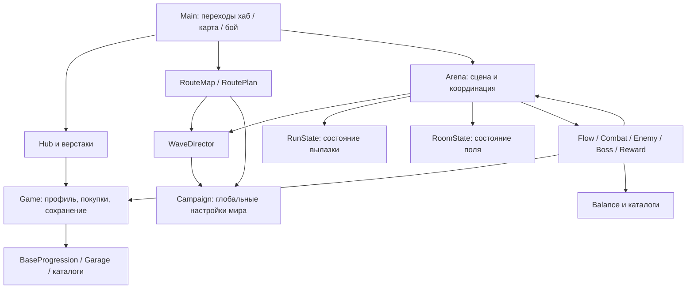

# Tank City — ревизия проекта

27 сентября 2026. Анализ текущего кода после v17-freeze. Архитектурные предложения ниже не реализованы: в этой итерации меняется только согласованная прогрессия боёв и связанные проверки.

## Вывод

У игры уже есть сильная основа: пехотинец захватывает технику, защищает штаб, выбирает риск и выносит добычу. Я бы строил дальнейшее развитие вокруг этих решений. Главный риск — расширять каталоги и постоянные улучшения быстрее, чем появляются разные боевые ситуации. Сначала надёжность профиля и ясные правила контента, затем разнообразие решений внутри вылазки.

Полная перепись не нужна. Состояние забега и комнаты уже отделено; бой разбит на системы; генерация воспроизводима; существует много проверок. Следующий шаг — укрепить границы этих частей, а не вводить ещё один большой слой абстракций.

## Исправленная прогрессия

Во всех трёх мирах: **6 обычных полей + босс**. На обычном поле три волны и минибосс. Шеврон обычных врагов и минибоссов равен номеру мира: I / II / III. Структура и число врагов не увеличиваются от номера мира; сохраняются существующие мировые множители характеристик. Их сочетание со строго фиксированным шевроном требует игрового замера сложности.

| Поле | Обычные волны | Минибосс |
|---|---|---|
| 1 | Солдаты с пистолетом/дробовиком/ПП/винтовкой, щитовик, гранатомётчик, снайпер | Щитовик / гранатомётчик / снайпер |
| 2 | Та же пехота | Багги / БТР |
| 3 | 3 пехотинца + багги, гранатная турель, БТР | Багги / БТР |
| 4 | 3 пехотинца + лёгкая техника | РПГшник / танк |
| 5–6 | 2 пехотинца + 2 лёгких противника + РПГшники/танки | РПГшник / танк |

Состав внутри группы варьируется; все типы не обязаны присутствовать в каждой волне. В тяжёлых волнах присутствуют оба новых типа, танков не больше трёх. Турель не становится минибоссом. Случайные дроны отключены на первых двух полях, чтобы не обходить ограничение на технику. Их редкие появления позднее сохранены. Ограничение касается противников; собственный транспорт игрока не забирается.

Правила находятся в `scripts/wave_director.gd`; `RoutePlan`, реальный спавн командира и его подпись на карте используют одну запись с типом и оружием. РПГ остаётся вариантом гранатомётчика, не новым дублирующим классом. Во втором мире удалены два лишних обычных поля; арена босса сохранена размером 30 клеток. Старые глобальные индексы миров пока сохранены для совместимости остальных формул.

## Карта зависимостей

Системы уже вынесены в файлы, но каждая получает весь `arena` и свободно изменяет соседнее состояние. Это облегчает прототипирование, однако разделение пока преимущественно файловое. Совместимые свойства Arena делегируют в RunState/RoomState: это не второй экземпляр состояния, удалять их вслепую нельзя.

## Приоритеты архитектуры

### P1. Надёжность сохранения

**Факт:** `scripts/game.gd`, `save_progress()` открывает основной файл на запись и сразу сериализует профиль. Нет временного файла, резервной копии и явного сообщения об ошибке. `load_progress()` принимает версии 1–9 общей веткой, хотя современные покупки добавлены отдельными полями. Вложенные значения не везде проверяются на тип перед `.get()`, `.slice()` и `.filter()`.

**Риск:** прерванная запись теряет профиль; повреждённое вложенное значение может сорвать загрузку. Это подтверждённая уязвимость конструкции, а не утверждение, что пользователь уже потерял данные.

**Предложение:** выделить ProfileStore: чтение → проверка структуры → последовательные миграции → нормализация → применение. Запись через временный файл в том же каталоге, проверку результата и замену с сохранением последней исправной копии. Новую схему получить миграцией, не сбросом. Тесты на пустой, обрезанный, неверно типизированный, старый и будущий формат; отказ записи и восстановление из копии. Только изолированные пути.

### P1. Контролируемая сборка и история изменений

**Факт:** `.git` отсутствует. Есть снимок release и резервные копии. В macOS preset стоит `all_resources` и пустой `exclude_filter`; iOS исключает часть папок, но не `art_demo`, `audio_demo`, `release`, `3d-sources_testmy`. iOS настроен на экспорт проекта, team/provisioning не заполнены, targeted_device_family=2 требует сверки с целью iPhone.

**Риск:** лишние импортируемые ресурсы попадают в область экспорта; воспроизводимость и откат зависят от ручных копий. Это не измеренный размер итогового приложения: экспорт в этой ревизии не делался.

**Предложение:** подключить Git с корректным игнором, исходники тяжёлого арта хранить отдельно от runtime. Разделить dev/release экспорт; исключить тесты, демо и резервные копии; проверить содержимое готового пакета и запуск на устройстве. Каталоги сейчас занимают примерно: assets 163 МБ, art_demo 116 МБ, audio_demo 51 МБ, release 256 МБ, tmp 16 МБ. Эти размеры нельзя складывать и называть размером игры.

### P1. Один договор о содержимом боя

**Факт:** до фикса минибосс, обычная волна и оружие РПГ имели отдельные правила. В Arena остаётся старая таблица ROOM_WAVES. WaveDirector объявляет BUDGETS/COUNTS/CAPS из ресурса, но актуальный build() не использует эти таблицы для генерации.

**Предложение:** небольшой EncounterSpec: состав волн, командир с оружием, допустимая поддержка, награда, seed. Из него строятся и бой, и разведданные. Настройки, которые реально не влияют на результат, убрать из редактора либо подключить; предварительно проверить потребителей. Ввести инварианты: 6 полей, 3 волны, тир, шеврон, отсутствие запрещённых ранних врагов. Текущий фикс уже централизует правило минибосса, но не реализует весь EncounterSpec.

### P2. Разделить профиль, покупки и экипировку

**Факт:** Game одновременно отвечает за ввод, профиль, валюты, покупки, классы, миграции, звук и открытия. Есть старые `ability_slots/equipped_abilities/selected_ability` и новые `class_first_slots/class_second_slots/gadget/purchased_gadgets`. `hero_loadout()` уже использует новую схему; старые поля ещё меняются другими методами.

**Предложение:** сохранить Game как совместимый фасад, последовательно вынести ProfileState, PurchaseService и LoadoutService. Для каждого предмета явно разделить: известен чертёж, куплен, экипирован. Старые поля удалять после карты обращений и миграционных тестов. Не превращать все категории предметов в один огромный универсальный объект.

### P2. Единый расчёт характеристик

**Факт:** формулы есть в `actor.gd` (`equip_weapon` и инициализация), `garage/catalog.gd` (`stats`), `ui/tablet_pages.gd` и Game. Пехотный и транспортный урон рассчитываются по разным формулам; само по себе это допустимый дизайн. Опасность — независимо повторять их для боя и превью.

**Предложение:** чистые функции расчёта пехоты/транспорта с явными входами профиля, вылазки и происхождения техники. UI показывает тот же результат. Проверять совпадение превью с реальным актором: своя машина, захваченная машина, смена оружия, карточка, смена класса.

### P2. Переходы и завершение вылазки

**Факт:** Flow имеет перечень фаз и сигнал смены, но проверяет только существование названия, не допустимость перехода. Main снимает арену с дерева на время карты и затем возвращает её. Награды/сохранения вызываются из нескольких мест; например claim() вызывает Game.earn(), который сохраняет профиль, и затем ещё save_progress().

**Предложение:** описать разрешённые переходы и единственную идемпотентную операцию завершения/выхода. Покупки и выдачу наград оформлять как завершённое изменение профиля с одной записью. Проверки: двойной клик, смерть в переходе, выход после победы, повторное получение награды, возврат через карту. Не менять весь scene lifecycle одним коммитом.

### P2. UI и события

**Факт:** FieldTablet строит панель 1060×690, удаляет и создаёт дочерние элементы на refresh(). Есть ScrollContainer — адаптивность уже частично предусмотрена. QuestNotifications опрашивает состояние каждые 0,25 секунды; отметки разделов используют строковые сигнатуры.

**Предложение:** начать с повторяемых карточек предмета/задания и общего контейнера панели, сохраняя визуальный стиль. Перейти к сигналам конкретных изменений профиля и заданий, обновлять только затронутый раздел. Проверить фокус, длинный русский текст, сенсорный ввод, безопасные зоны и масштаб на реальном телефоне. Фиксированные размеры сами по себе ещё не доказывают поломку: есть масштабирование canvas_items.

### P3. Оптимизация только после измерений

**Наблюдение кода:** каждый снаряд делает подшаги длиной около 0,1 клетки; bullet_hit() перебирает снаряды и акторов, местами создавая копии массивов. Попарные проверки снарядов дают потенциальный квадратичный участок при большом залпе. Visuals.material() создаёт новый материал на вызов; пули создают геометрию при появлении.

**Порядок:** фиксированный seed, худший залп босса, тяжёлая волна, много подборов; измерить p50/p95/p99 кадра, CPU физики, количество узлов/снарядов, draw calls и память. Если подтверждено: пространственный индекс по клеткам для попаданий, общие неизменяемые материалы, затем пул наиболее частых эффектов. Общий материал нельзя разделять между объектами, которые независимо меняют цвет. FPS и выигрыш этой ревизией не измерены.

## Что улучшить в игре

### Сохранить ядро

Самый интересный момент — решение «добить машину или занять её», особенно когда штаб под угрозой. Я бы усиливал цепочку: распознать опасность → выбрать цель → рискнуть ради техники → изменить стиль боя → решить, продолжать ли путь с добычей. Новые валюты, дополнительные редкости и ещё десятки пассивных процентов сейчас не нужны.

### Сделать три волны различимыми

Предложение для прототипа: первая знакомит с угрозой, вторая сочетает её с поддержкой, третья меняет направление давления или требует манёвра; затем командир проверяет выученное. Сейчас количество и случайный состав меняются, но отдельной драматургии волны нет. Сохранить согласованные тиры, варьировать роли и заходы. Не добавлять обязательный новый режим на каждое поле.

### Сделать развилку настоящим решением

WaveDirector получает seed/поле/волну, но не выбранную ветку. Обычные волны соседних узлов одинаковы; ветка влияет на командира, элитность и награду. Предлагаю два понятных профиля в рамках того же тира: «опасный дальний огонь — лучше ресурсная награда» и «подвижный натиск — шанс выгодного захвата». Разведданные должны показывать различие до входа. Проверять, выбирают ли игроки обе ветки, а не всегда одну очевидно выгодную.

### Сократить однообразие карточек

Общий темп и темп оружия, общий урон и урон оружия различаются областью действия, но могут ощущаться одной кнопкой «больше цифра». Сначала заменить один дубль поведенческим эффектом: усиленный первый выстрел после короткой паузы или короткий бонус после выхода из техники. Сделать три различимые сборки без новой системы комплектов: мобильный стрелок, контроль проходов, водитель с ремонтом. Это предложения, а не внесённые изменения.

### Удержание через освоение, а не необходимость проиграть

Первый навык должен быстро давать ощутимый новый ход; второй — быть привлекательной целью, а не единственным способом пройти мир. Бесконечное здоровье/урон уже согласованы: я бы сохранял их, но проверял, можно ли пройти первый мир умением при скромных покупках. После смерти показывать конкретную причину и ближайший доступный ответ. Защита штаба должна оставаться читаемой и управляемой, а не наказанием за врага вне экрана.

### Миры отличаются тактикой, не длиной

Структура 6 полей одинакова. Внутри неё мир 1 обучает укрытиям/захвату, мир 2 — сочетаниям угроз и маршрутам, мир 3 — приоритетам целей и экономии поддержки. Шевроны и существующие множители уже повышают сложность; дополнительное здоровье врагов стоит добавлять осторожно, чтобы не растягивать одинаковые перестрелки. Разницу лучше получать геометрией и поведением.

## Практический порядок работ

1. **Надёжный профиль + проверяемая сборка.** Готово, когда прерванная запись восстанавливается, миграции проходят тесты, пакет не содержит демо, приложение запускается на целевом устройстве.
2. **Контракт боя и формулы статов.** Готово, когда карта и бой совпадают, параметры редактора действительно работают, превью равно характеристикам в бою.
3. **Одна улучшенная вылазка.** Только один мир: заметно разные три волны, две осмысленные ветки, один поведенческий эффект карточки. Сравнить с текущей версией на одинаковой начальной силе.
4. **UI и производительность по результатам.** Контейнеры и события, затем только измеренные горячие участки. После этого расширять контент.

Для первого игрового замера: 5–8 новых игроков, одинаковый старт, 20–30 минут. Записать время первой покупки, первого захвата и первого минибосса; причины смертей; время в бою/хабе/меню; выбранные ветки и карточки; готовность начать следующую вылазку и объяснение игрока. Это исследование первых проблем, не статистическое доказательство удержания. Длительность полного прохождения и цель «час на мир» пока не подтверждены.

## Проверки и границы ревизии

Автопроверка tiers покрывает 16 200 составов (3 мира × 300 seeds × 6 полей × 3 волны), разрешённые группы, сокращение старых тиров, шевроны, повторяемость и минибоссов всех трёх веток. Дополнительно проверяется реальный спавн танка и РПГ-командира. Актуализирован тест progression_v16, запущены command_v16 и dev_shop_v17. Сохранение тестируется отдельным файлом /tmp; в тестовых сценах отключена запись пользовательского профиля и настроек.

Это анализ исходников и headless-проверки логики, без утверждения о визуальной проверке, профилировании GPU, сборке iOS или полноценном прохождении человеком. Резервные копии изменённых исходников находятся в `tmp/pre-wave-tier-fix/`. Снимок v17-freeze не изменялся.
